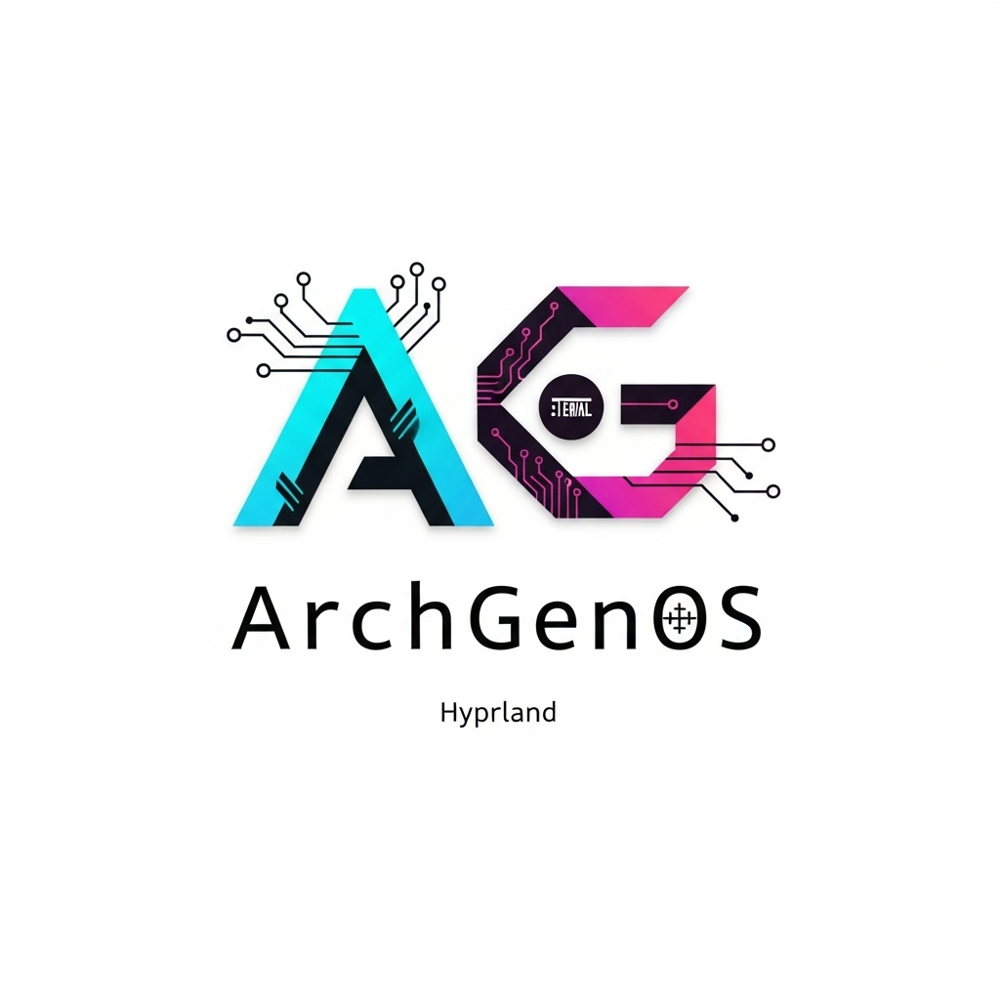

# ArchGenOS

ArchGenOS est une distribution Arch Linux légère, moderne et prête à l'emploi, conçue pour offrir une expérience de bureau fluide et personnalisable avec le compositeur Wayland [Hyprland](https://hyprland.org/).

Ce dépôt contient tout le nécessaire pour construire l'image ISO d'ArchGenOS. La compilation est automatisée à l'aide de GitHub Actions, mais peut également être effectuée manuellement.

  <!-- L'utilisateur devra ajouter cette image -->

## Fonctionnalités

*   **Bureau Hyprland :** Un compositeur Wayland dynamique et extensible avec des animations fluides.
*   **Léger et rapide :** Basé sur Arch Linux, le système est minimal et réactif.
*   **Prêt à l'emploi :** Inclut un ensemble d'applications et de configurations par défaut pour une expérience de bureau complète dès le premier démarrage.
*   **Compilation automatisée :** L'ISO est automatiquement compilé via GitHub Actions à chaque `push` sur la branche `main`.

## Compilation

### Via GitHub Actions (recommandé)

1.  Faites un `fork` de ce dépôt.
2.  Activez les "Actions" dans les paramètres de votre dépôt forké.
3.  Effectuez un `push` sur la branche `main` de votre dépôt (par exemple, en modifiant ce README).
4.  L'action de compilation se déclenchera. Une fois terminée, vous pourrez télécharger l'image ISO directement depuis l'onglet "Actions" en tant qu'artefact de build.

### Manuellement (sur un système Arch Linux)

1.  **Installer `archiso` :**
    ```bash
    sudo pacman -S archiso
    ```

2.  **Cloner le dépôt :**
    ```bash
    git clone https://github.com/VOTRE_NOM/archgenos.git
    cd archgenos
    ```

3.  **Lancer la compilation :**
    ```bash
    sudo mkarchiso -v -w /tmp/archiso-work -o out/ ./archiso
    ```

4.  L'image ISO compilée sera disponible dans le répertoire `out/`.

## Personnalisation

La personnalisation de la distribution se fait en modifiant les fichiers du profil `archiso/`.

*   **Ajouter/Supprimer des paquets :** Modifiez le fichier `archiso/packages.x86_64`.
*   **Modifier les configurations par défaut :** Les fichiers de configuration pour Hyprland, Kitty, Waybar, etc., se trouvent dans `archiso/airootfs/etc/skel/.config/`. Ces fichiers sont copiés dans le répertoire personnel de l'utilisateur live.
*   **Changer l'identité de la distribution :** Le nom, la version et d'autres métadonnées de l'ISO peuvent être modifiés dans `archiso/profiledef.sh`.
*   **Modifier le logo de démarrage :** Remplacez les fichiers `splash.jpg` dans `archiso/isolinux/` et `archiso/efiboot/grub/` par votre propre image.
*   **Scripts d'installation :** Pour des configurations plus avancées (par exemple, la création d'utilisateurs, la configuration de services), vous pouvez créer des scripts et les exécuter depuis `archiso/airootfs/root/customize_airootfs.sh` (ce fichier doit être créé).

## Licence

Ce projet est sous licence MIT.
